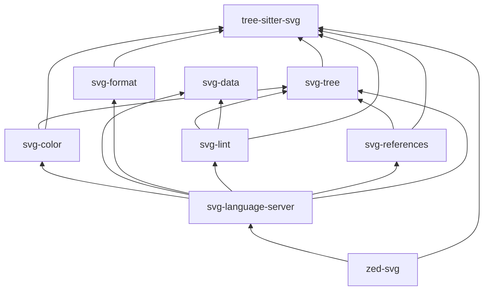

# svg

SVG tooling monorepo.

This repository contains the SVG language server, parser grammar, editor
integration, and the Rust crates that power formatting, linting, color analysis,
spec data lookup, and definition/reference navigation.

> [!IMPORTANT]
> Published as pre-1.0 (`0.x`): expect breaking changes between releases while
> the workspace is under active development.

## Install

From crates.io:

```sh
cargo install svg-language-server
cargo install svg-lint
cargo install svg-format
```

From npm (prebuilt binaries, no Rust toolchain needed):

```sh
npm install --global svg-language-server svg-lint svg-format
```

From source:

```sh
cargo install --git https://github.com/kjanat/svg svg-language-server
```

## Workspace Contents

| Path                                 | Purpose                                                                |
| ------------------------------------ | ---------------------------------------------------------------------- |
| `crates/svg-language-server`         | LSP binary for SVG files                                               |
| `crates/svg-format`                  | Structural SVG formatter library and CLI                               |
| `crates/svg-lint`                    | Structural SVG diagnostics                                             |
| `crates/svg-color`                   | Color extraction and color presentation helpers                        |
| `crates/svg-data`                    | Generated SVG catalog from spec, BCD, and web-features data            |
| `crates/svg-data-regen`              | Deterministic catalog regeneration pipeline                            |
| `crates/svg-references`              | Symbol extraction for `id`, CSS class, and custom property definitions |
| `crates/svg-tree`                    | Shared tree-sitter helpers and tree utilities                          |
| `grammars/tree-sitter-svg`           | Tree-sitter grammar for SVG                                            |
| `grammars/tree-sitter-svg-paint`     | Injected grammar for paint/color attribute values                      |
| `grammars/tree-sitter-svg-path`      | Injected grammar for path data (`d`)                                   |
| `grammars/tree-sitter-svg-transform` | Injected grammar for transform lists                                   |
| `editors/zed-svg`                    | Zed extension for SVG language support                                 |

### Dependency Graph



## Language Server Features

- `textDocument/hover` for element and attribute docs, MDN links, and baseline
  status
- `textDocument/completion` for SVG element, attribute, value, and inline CSS
  completions
- `textDocument/publishDiagnostics` for structural validation such as unknown
  elements, invalid nesting, duplicate IDs, deprecated usage, and missing local
  references
- `textDocument/documentColor` for paint color discovery in SVG attributes and
  embedded stylesheets
- `textDocument/colorPresentation` for converting colors between multiple
  CSS/SVG formats
- `textDocument/definition` for local `id` targets plus CSS class and custom
  property definitions
- `textDocument/formatting` for deterministic structural SVG formatting

## Color Support

`svg-color` recognizes and presents a broad set of CSS/SVG color syntaxes,
including:

- hex
- `rgb()` and `rgba()`
- `hsl()` and `hsla()`
- `hwb()`
- `lab()` and `lch()`
- `oklab()` and `oklch()`
- named colors
- derived values from embedded CSS such as `var(...)` and `color-mix(...)`

## Getting Started

### Prerequisites

- Rust toolchain
- `just`
- `dprint`
- `bun`

### Build And Test

```sh
just build-debug
just verify
```

### Run The Language Server

```sh
just run-lsp
```

### Install Local Binaries

```sh
just install-lsp
just install-svg-format
```

### Install Published Binaries With npm

```sh
npm install --global svg-language-server   # also installs the `svg-ls` alias
npm install --global svg-lint
npm install --global svg-format
```

Each package resolves a prebuilt binary for the current OS/architecture through
`optionalDependencies` on `@svg-toolkit/*` platform packages — no postinstall
step, no install-time downloads outside npm.

If you want to install directly from GitHub instead of a local checkout:

```sh
cargo install --git https://github.com/kjanat/svg svg-language-server
```

## Repository Layout

```text
crates/
  svg-language-server/  LSP binary and request handlers
  svg-format/           formatter library and CLI
  svg-lint/             diagnostics engine
  svg-color/            color parsing, extraction, and presentation
  svg-data/             generated SVG catalog
  svg-references/       definition/reference analysis
  svg-tree/             shared tree-sitter helpers and tree utilities
grammars/
  tree-sitter-svg/      Tree-sitter grammar and language queries
editors/
  zed-svg/              Zed extension
docs/
  plans/
  specs/
samples/                manual fixtures and examples
```

## Development Commands

```sh
just format-check
just format
just lint
just typecheck
just test
just verify
```

## Editor Setup

### VS Code

Add to `.vscode/settings.json`:

```jsonc
{
	"svg-language-server.path": "svg-language-server", // or absolute path
	"[svg]": {
		"editor.defaultFormatter": "svg-language-server",
	},
}
```

Or use a generic LSP extension like
[vscode-lsp-client](https://marketplace.visualstudio.com/items?itemName=nicolo-ribaudo.vscode-lsp-client)
and point it at the `svg-language-server` binary.

### Neovim (nvim-lspconfig)

```lua
vim.api.nvim_create_autocmd("FileType", {
  pattern = "svg",
  callback = function()
    vim.lsp.start({
      name = "svg-language-server",
      cmd = { "svg-language-server", "--stdio" },
    })
  end,
})
```

### Zed

For local development, install the extension under `editors/zed-svg` with:

```text
zed: Install Dev Extension
```

The extension installs or falls back to the `svg-language-server` binary and
uses the SVG grammar/query package from this repository.

If you are wiring a separate extension manually, add this to its
`extension.toml`:

```toml
[language_servers.svg-language-server]
languages = ["SVG"]
```

### Other Editors

Any LSP-compatible editor works. Point it at `svg-language-server --stdio` with
filetype `svg`. The server communicates over stdin/stdout using the standard
Language Server Protocol.

## Known Limitations

- **No rename/refactoring** — `id`, class, and custom property renames are not
  yet supported
- **No workspace-wide diagnostics** — only open documents are linted
- **Regeneration is networked** — normal builds use checked-in catalog data, but
  `svg-data-regen` intentionally contacts upstream specs and compatibility
  sources when refreshing the catalog

## Formatter Plugin

The dprint plugin lives in a separate repository: [kjanat/dprint-plugin-svg]

## Release Publishing

- Git tags publish all three binaries (`svg-language-server`, `svg-lint`,
  `svg-format`) for every supported target to one GitHub Release.
- npm facades `svg-language-server`, `svg-lint`, and `svg-format` plus their
  `@svg-toolkit/*` platform packages are published from GitHub Actions; the
  workspace crates are published to crates.io.
- Run `just release-local <version>` to bump versions, run `just verify`,
  commit, and create the local `v<version>` tag. This requires `bun` locally.
  Pushing that tag triggers publication.
- See `docs/releasing.md` for the bootstrap and trusted-publisher details.

[kjanat/dprint-plugin-svg]: https://github.com/kjanat/dprint-plugin-svg
